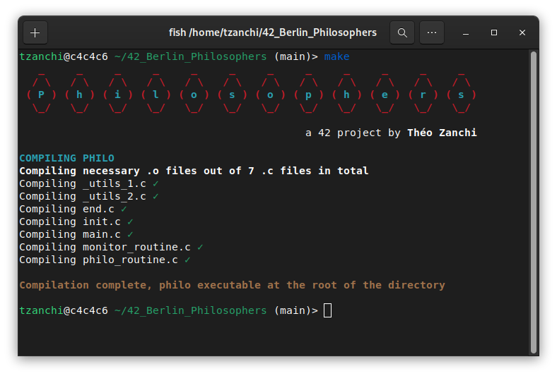
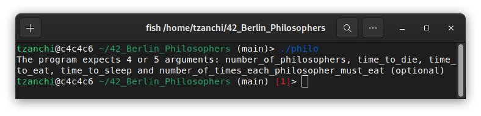
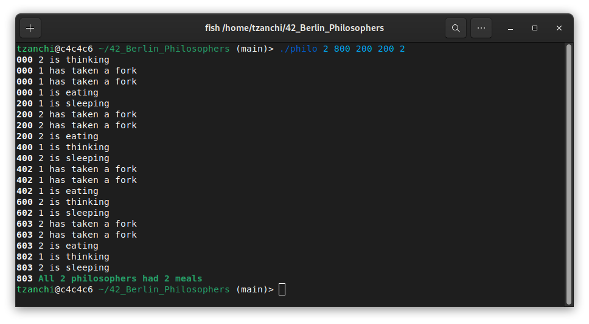
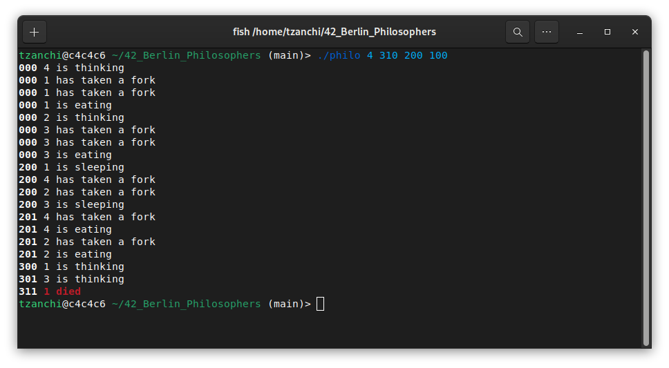

   

# Philosophers

This project is about multi-threading: the program simulates a dinner between a group of `nbr_of_philo` philosophers. They share a bowl of spahghetti in the middle of the table and one fork per person. 
A fork is placed between each philosopher; a philosopher can only eat with the help of the two forks on its left and on its right. 
Mutex should be used to lock the forks for each philosopher to prevent them from stealing each other forks.
Once a philosopher has eaten for `time_to_eat` milliseconds, he starts to sleep for `time_to_sleep` milliseconds and then starts to think. He thinks for as long as he canm but at least 2 milliseconds. 
If a philsopher has not started eating since `time_to_die` milliseconds after the beginning of the simulation or the beginning of his last meal, he dies. 
The program displays the logs of the simulation according to the following format:
* timestamp_in_ms X has taken a fork
* timestamp_in_ms X is eating
* timestamp_in_ms X is sleeping
* timestamp_in_ms X is thinking
* timestamp_in_ms X died

The full subject can be found [here](.media/en.subject.pdf).

# Downloading and compiling the project

Clone the library and use `make` to compile
```
git clone https://github.com/theozanchi/42_Berlin_Philosophers/tree/main
cd 42_Berlin_Philosophers
make
```


# Running the program
The program expects 4 or 5 arguments:
* `nbr_of_philo`: the number of philosophers and also the number of forks
* `time_to_die`: if a philosopher didn’t start eating `time_to_die` milliseconds since the beginning of their last meal or the beginning of the simulation, they die
* `time_to_eat`: the time it takes for a philosopher to eat. During that time, they will need to hold two forks
* `time_to_sleep`:  The time a philosopher will spend sleeping
* [optional] `nbr_of_meals`: If all philosophers have eaten at least `nbr_of_meals` times, the simulation stops. If not specified, the simulation stops when a philosopher dies




Example of a valid simulation, where all philosophers survive:


Example of a simulation that does not allow all philosophers to survive:


The program is safe to use for simulations up to 200 philosophers

# Data structure and list of functions
Each philosopher is represented by a structure that contains the reference to a thread that will be use to simulate the life of a philosopher (`eat`, `sleep`, `think`).
```
typedef struct s_philo
{
	size_t			id;
	int				left_fork_id;
	int				right_fork_id;
	clock_t			last_meal;
	pthread_mutex_t	last_meal_mutex;
	size_t			nbr_of_meals;
	int				philo_is_full;
	pthread_t		routine;
	struct s_data	*data;
	struct s_philo	*next;
}	t_philo;
```
All the data is nested into a macro `t_data` structure that contains a reference to the philosopher with ID `1`.
```
typedef struct s_data
{
	size_t			nbr_of_philo;
	clock_t			time_to_die;
	clock_t			time_to_eat;
	clock_t			time_to_sleep;
	size_t			nbr_of_meals;
	int				end_of_simulation;
	pthread_mutex_t	end_of_simulation_mutex;
	size_t			nbr_of_full_philo;
	pthread_mutex_t	nbr_of_full_philo_mutex;
	t_philo			*philo;
	pthread_mutex_t	*forks;
	pthread_mutex_t	display_mutex;
	clock_t			start_time;
	int				start_of_simulation;
	pthread_mutex_t	start_of_simulation_mutex;
}	t_data;
```

The following functions are part of the project:
```
/*_utils_1.c*/
int		ft_atoi(const char *nptr);
int		ft_isspace(int c);
int		ft_isdigit(int c);
int		ft_isnumeric(char *str);
int		ft_strcmp(const char *s1, const char *s2);

/*_utils_2.c*/
int		ft_min(int a, int b);
int		ft_max(int a, int b);
clock_t	get_time(void);
int		display_log(char *log, t_philo *philo);
void	wait_for_start(t_data *data);

/*end.c*/
void	destroy_forks(t_data *data);
void	free_philosopher(t_philo *philosopher);
int		free_data(t_data *data, int exit_code);
int		join_philo_threads(t_data *data);

/*init.c*/
t_philo	*new_philosopher(size_t philo_id, t_data *data);
int		init_philosophers(t_data *data);
int		init_forks(t_data *data);
int		init_data(t_data *data, char **argv);
int		launch_threads(t_data *data);

/*main.c*/
int		check_arguments(int argc, char **argv);
int		main(int argc, char **argv);

/*monitor_routine.c*/
int		philo_is_dead(t_philo *philo);
int		all_full_philo(t_data *data);
void	monitor_routine(t_data *data);

/*philo_routine.c*/
void	takes_forks(t_philo *philo);
void	is_eating(t_philo	*philo);
void	is_sleeping(t_philo *philo);
void	is_thinking(t_philo *philo);
void	*routine(void *void_philo);
```
